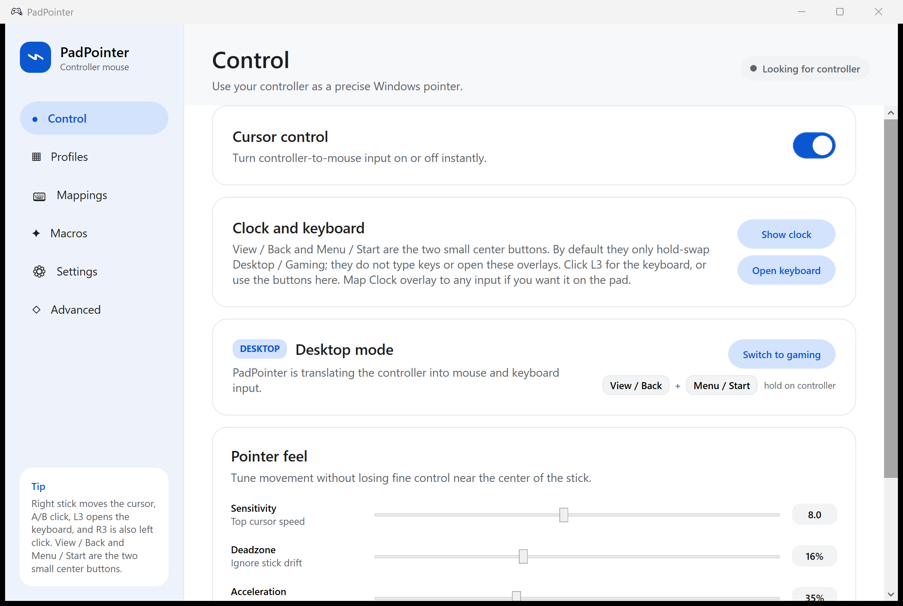
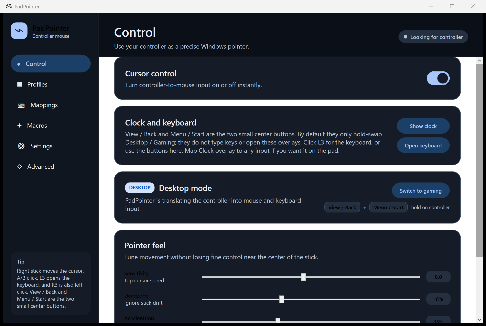
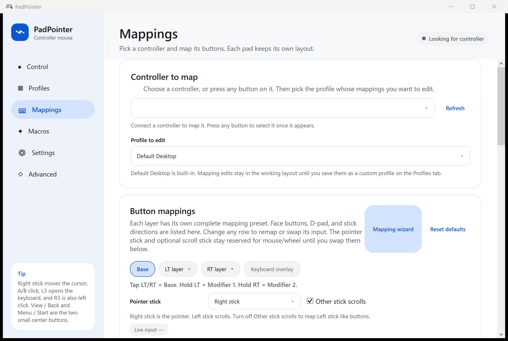
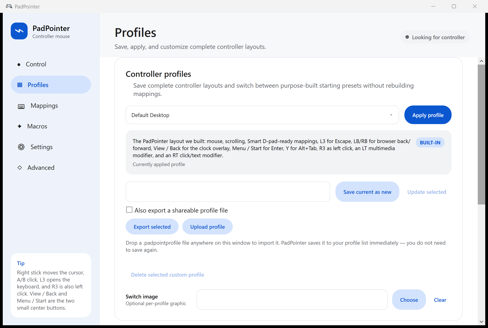
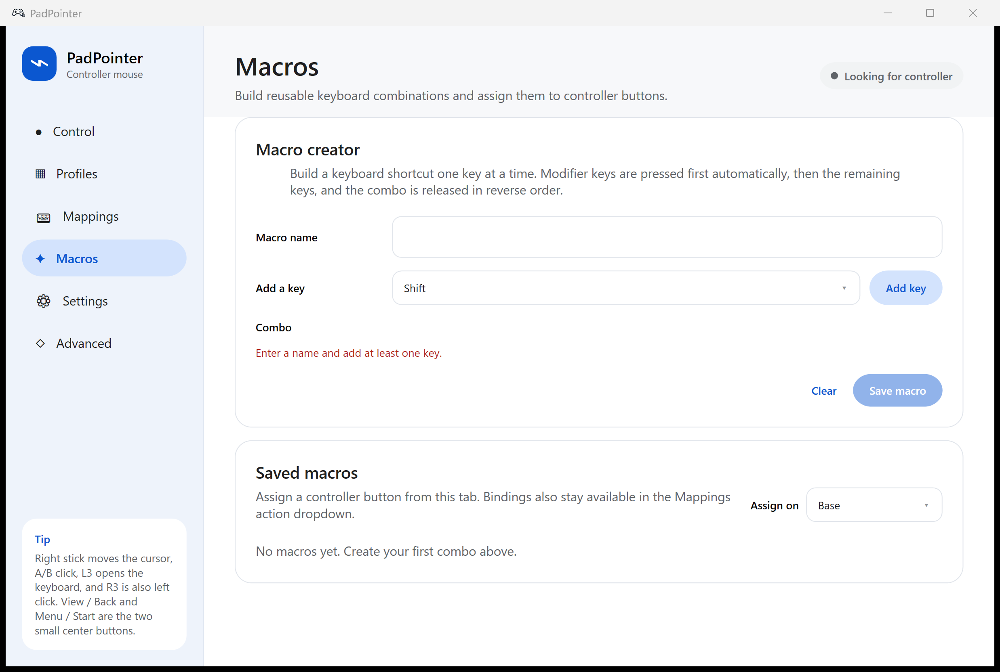
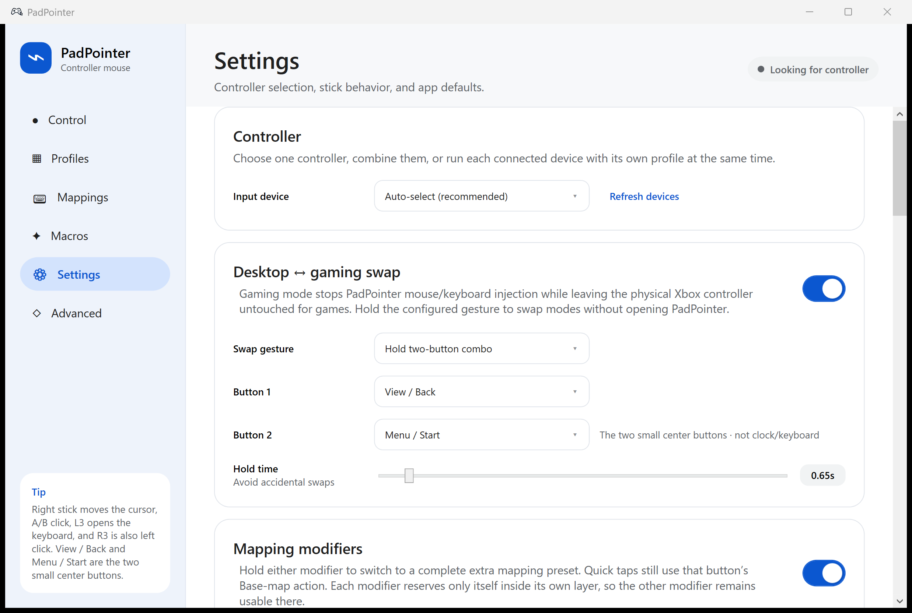
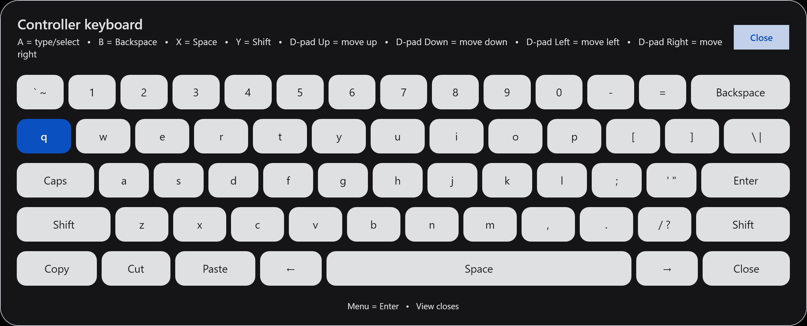
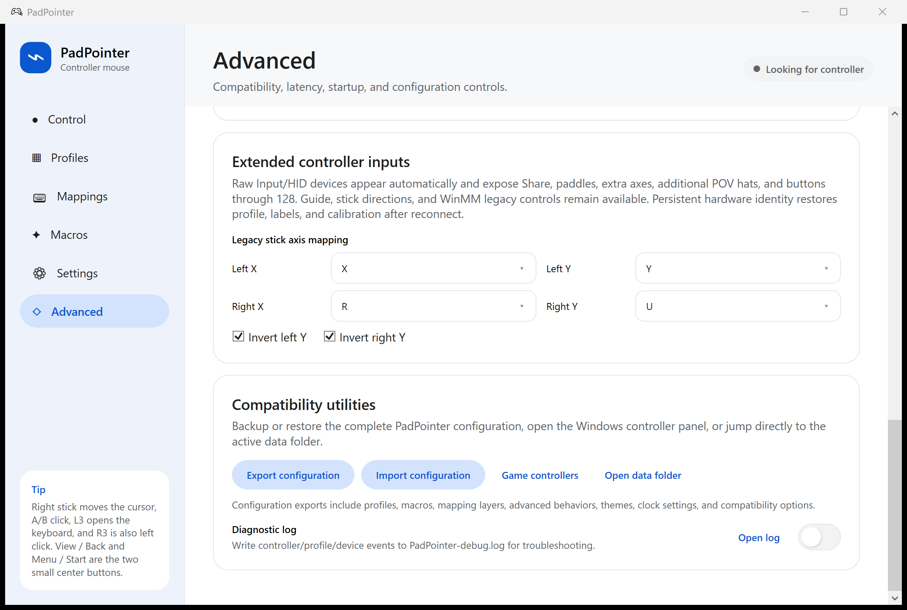

  

<h1 align="center">PadPointer</h1>

<strong>Use an Xbox controller as a mouse and keyboard on Windows.</strong>

  
  
  

<a href="https://github.com/Syenar/PadPointer/releases/latest"><strong>Download PadPointer.exe or PadPointer-Setup.exe</strong></a>

This repository is the public download page. PadPointer ships as a compiled Windows app. Map an Xbox, HID, DualSense-style, or legacy joystick to mouse, keys, macros, volume, and on-screen controls. Games still see the real pad: PadPointer injects mouse and keyboard. It does not hide or exclusively own the controller.

  

## Install

1. Open the [latest Release](https://github.com/Syenar/PadPointer/releases/latest).
2. Grab **PadPointer-Setup.exe** if you want a folder picker, or **PadPointer.exe** for a portable app.
3. Run it on 64-bit Windows 10 or 11. Plug in an Xbox-compatible controller and move the right stick.

Windows SmartScreen may warn on first launch because the EXE is not code-signed. Choose **More info → Run anyway** if you downloaded it from this GitHub account.

Settings live in `%AppData%\PadPointer`. **Settings → Install latest from GitHub** replaces the EXE in place and leaves those settings alone.

## Why this instead of a typical remapper

- **Games keep the pad.** Desktop mode injects mouse and keyboard. Gaming mode pauses injection. Hold **View + Menu** (the two small center buttons) to swap.
- **Three mapping layers.** Base is everyday desktop. Hold **LT** for media, **RT** for clicks and text. Tap still uses the Base action on that trigger.
- **Smart D-pad.** The D-pad jumps the pointer to the next real on-screen control using Windows UI Automation. It snaps to the control. It does not roam empty pixels.
- **Layouts you can live with.** Built-in profiles for desktop, FPS, MOBA/ARPG, media, writing, and presenting. Save your own or drop a `.padpointprofile` onto the window.

If you have used JoyToKey, AntiMicroX, or Steam’s desktop layout: same idea, with a modern Windows UI, overlay keyboard, clock, themes, and a gaming-mode swap that does not steal the controller.

## What it looks like

These shots are the real app.

  

| Button mappings | Saved layouts |
| --- | --- |
|  |  |

| Macros | Settings |
| --- | --- |
|  |  |

  

  

  

## Everyday features

- Right or left stick as the Windows pointer; the other stick can scroll.
- Full Xbox / XInput coverage: A/B/X/Y, bumpers, triggers, View/Menu, L3/R3, D-pad, stick directions.
- Mouse: left / right / middle click, drag, Back / Forward, vertical and horizontal wheel.
- Keyboard capture, Copy / Cut / Paste, Refresh, macros, media keys, clock overlay.
- **Turbo** per binding (0.1–60 Hz).
- Ten themes: Porcelain, Midnight, Sage, Clay, Graphite, Ocean, Dusk, Ember, Sand, Nord.
- Close the window and PadPointer stays in the tray by default.

### Default LT media layer

Hold **LT**. Tap LT still uses the Base action.

| Input | Action |
|---|---|
| A | Play / Pause |
| B | Stop |
| X | Previous |
| Y | Next |
| LB | Rewind |
| RB | Fast-Forward |
| D-pad Up / Down | Volume (turbo) |
| D-pad Left / Right | Previous / Next |

### Default RT click and text layer

Hold **RT**.

| Input | Action |
|---|---|
| A | Left click |
| B | Backspace |
| X | Space |
| Y | Paste |
| LB | Right click |
| RB | Delete |
| LT | Shift |
| D-pad | Arrow keys |

## Smart D-pad

The Base-layer D-pad becomes a spatial picker: PadPointer indexes visible accessible controls across apps and moves the pointer to the verified center of the best target in that direction. No pixel rays, no nudges. Games and other surfaces that do not expose UI Automation cannot snap. Hold LT or RT and the D-pad uses that layer’s mappings instead.

## Controller keyboard and clock

**L3** (or **Open keyboard**) opens a QWERTY overlay that types into whatever already has focus. Default binds: D-pad moves, A types, B backspace, X space, Y shift, Menu Enter, View closes. The hint bar follows your remaps.

The clock overlay is a normal mapping (View / Back on Default Desktop). Toggle or hold, several styles, click-through, Windows system time.

## Controllers

Xbox-class pads (XInput), extra Windows joysticks (WinMM), and Raw Input / HID for Share / Capture, paddles, extra hats, and buttons through 128. Auto-select, pin a device, combine pads, or give each controller its own profile. PlayStation-style button names are available as a label template.

## FAQ

**Can I use an Xbox controller as a mouse on Windows?**  
Yes. Default Desktop: right stick moves the cursor, A/B click, other stick scrolls.

**Will my games still see the controller?**  
Yes. PadPointer does not take exclusive ownership. Hold View + Menu for Gaming mode to pause injection.

**Is this a JoyToKey alternative?**  
If you want gamepad-to-keyboard mapping, macros, and turbo on Windows, yes — plus Smart D-pad, an on-screen keyboard, and profiles.

**Does DualSense work?**  
If Windows sees it as XInput, a joystick, or HID, PadPointer can use it.

## License

PadPointer is distributed as an official compiled executable from this repository’s Releases. See [LICENSE](LICENSE).
